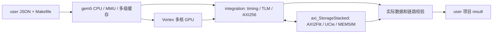

# Vortex StorageStacked

基于 gem5 多核 CPU 与 Vortex GPU 执行用户程序，经 AXI256、UCIe 访问在线 MEMSIM。用户在 `user/` 配置、编译、运行和查看结果；`integration/` 提供与独立 AXI 存储项目的连接。

## 目录

```text
vortex_StorageStacked/
├── README.md
├── build.sh
├── user/
│   ├── run.sh
│   ├── smoke/               config.json + src/Makefile、smoke.cpp + result/
│   └── llm/                 config.json + src/Makefile、tinyllm.h/.cpp + result/
├── docs/                    用户说明和研究成果分析
├── third_party/             gem5、Vortex、SDK、内部工具与构建缓存
└── integration/             gem5/TLM 到公共 AXI 存储的桥接
```

## 首次构建

将两个仓库放在同级目录：

```bash
git clone https://github.com/hy2581/axi_StorageStacked.git
git clone https://github.com/hy2581/vortex_StorageStacked.git
cd vortex_StorageStacked
./build.sh --storage ../axi_StorageStacked --jobs 12
```

环境为 Linux x86-64；首次构建准备固定版本工具和平台。使用相对路径保存依赖位置，不使用 submodule。复制源码到新位置后重新执行 `build.sh`，脚本管理内部缓存。

## 运行项目

```bash
cd user
./run.sh smoke
./run.sh llm
# 自选结果目录，每次使用新目录
./run.sh smoke --output result/my-check
```

- **SMOKE**：默认输入 `41`，四个工作组分别写入、读回、加一，输出 `42`。
- **LLM**：与 CoralNPU 示例采用相同 TinyLLM 模型；输入 `"red "`，生成 `"blu"`，token ID `[4, 10, 15]`。

每个项目只有一个 `config.json`。其中配置程序输入、GPU 核/warp/线程、CPU 核数、MMU/TLB、缓存、AXI、UCIe、MEMSIM 和仿真上限。修改后直接运行；需要更新的平台编译由入口处理。

新增项目遵循同样结构：`user/<项目>/config.json` 和 `src/Makefile`、源文件。`./run.sh <项目>` 不需要注册项目名，Makefile 通过 SDK 生成主机及设备程序。

## 输出和验收

结果保存到 `user/<项目>/result/<运行目录>/`。入口打印 `report.md` 位置；成功要求 `summary.json` 的 `passed: true`。

报告给出输入输出、GPU 周期、事务和独立校验结果。目录还保存配置、编译成果、实际回读字节、地址转换、缓存统计、AXI VCD、Flit、内存记录和链路视图。TinyLLM 会逐项核对权重、KV、中间结果与 token。

```bash
# 在 user/ 中执行单类回归
./run.sh smoke --test
./run.sh llm --test
# 在仓库根目录执行整体构建与回归
./build.sh --test
```

本次重构已完成 8 组平台场景、从零添加项目的 2 次运行、19 项原生测试、在线内存接口与 22 项错误拒绝检查。精简记录见 [重构验收](third_party/validation/2026-09-25-user-layout/README.md)。默认 SMOKE 为 `41 → 42`，TinyLLM 为 `"red " → "blu"`；慢内存、KV cache、重放及硬件参数变更均通过独立核对。

## 运行链路



主机程序和栈使用主机内存；主机访问 GPU BAR 和 GPU 外部访存走公共存储链路。设备执行、缓存行为、实际返回数据和存储延迟共同决定仿真结果。gem5 使用自带的一套 SystemC，时间基准为 1 fs。

`axi_StorageStacked` 提供统一存储接口；`coralnpu_StorageStacked` 通过其原生 NPU 桥独立接入相同接口，各运行实例拥有独立内存状态。

## 文档

| 文档 | 内容 |
|---|---|
| [用户环境配置说明](docs/01-用户环境配置说明.md) | 准备环境、全部参数、运行和输出 |
| [从 0 添加 SMOKE 简要指南](docs/02-用户从0开始添加SMOKE简要指南.md) | 按步骤添加新项目，解释输入和输出 |
| [LLM 简要说明](docs/03-LLM简要说明.md) | 两个源码文件、推理流程、KV 和数值核对 |
| [integration 介绍](docs/04-integration介绍.md) | 七个文件各自职责与流程图 |
| [研究成果一分析](docs/05-研究成果一分析.md) | 三项目如何实现 SoC 模型各项内容 |

上游许可证和版本记录保留在 `third_party/`；交付源码包含本平台所需的集成扩展，来源记录见 [third_party/patches/README.md](third_party/patches/README.md)。
