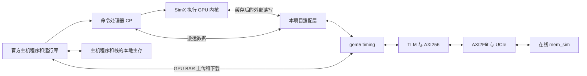

# 1. 本项目对 Vortex 做了哪些修改

核对日期：2026-09-25。本文只介绍当前 `vortex_StorageStacked` 工程。

本项目保留 Vortex 的 SimX 计算模型，主要修改它与外部内存之间的接口：让 GPU 发出的外部读写进入 gem5，再通过 AXI、UCIe 到达在线 mem_sim，最后把真实数据和完成通知送回 GPU。

可以把 SimX 理解成“用 C++ 写成的 GPU 仿真器”。它负责执行 GPU 指令、调度 warp 和处理缓存；gem5 负责推进仿真时间、运行主机程序，以及传递外部访存请求。当前执行的是这种功能/周期模型。

## 一、先看完整分工

这里有几个容易混淆的词：

| 名称 | 通俗解释 |
|---|---|
| kernel / 内核 | 在 GPU 上执行的小程序，例如向量相加、矩阵乘法 |
| warp | GPU 一起调度的一组线程 |
| CP | 命令处理器，接收主机命令，安排数据搬运和内核启动 |
| DMA | 搬运数据的请求；这里通过 gem5 的读写接口发送 |
| BAR | 主机能够访问的 GPU 地址窗口，用来上传和取回数据 |
| timing | 请求发出后要等待真实的仿真响应，耗时会影响后续执行 |

GPU 内部缓存命中的访问、片上局部存储访问，不需要经过整条外部内存链路。

## 二、直接修改了 SimX 的什么地方

可追踪的适配补丁是 [simx_online.patch](../integration/vortexint/patches/simx_online.patch)。它修改了 SimX 的 7 个源码文件，集中在下面三组。

### 1. 给外部内存请求增加“发出”和“完成”接口

位置：[memory.cpp](../third_party/vortex/sim/simx/mem/memory.cpp)、[memory.h](../third_party/vortex/sim/simx/mem/memory.h)。

原有本地内存路径可以在 SimX 内部处理请求。现在安装外部接口后，请求会交给 gem5，携带地址、读写方向、写入数据和字节使能。

每个已接收请求都有一个编号，代码中称为 `token`，用于把返回结果与原请求对应起来。**这里的 token 是访存请求编号，与 LLM 的文本 token 无关。**

等待期间，请求保存在“未完成列表”中。gem5 返回后，`complete_external()` 保存读数据或标记写操作完成；到 SimX 正常的周期边界，再从响应通道交回数据。接口还允许接收方暂不接收请求，此时请求留在原队列中，避免丢失。

这样，读请求拿到的是 mem_sim 经完整链路返回的数据，后端延迟也能影响 GPU 的执行。

### 2. 处理器必须等外部请求完成

位置：[processor.cpp](../third_party/vortex/sim/simx/processor.cpp)、[processor.h](../third_party/vortex/sim/simx/processor.h)、[processor_impl.h](../third_party/vortex/sim/simx/processor_impl.h)。

这些文件把“安装外部访存接口”和“交回完成结果”的操作传递到内存模块。

另外，`any_running()` 在判断 GPU 是否结束时，会检查是否还有外部访存没有完成。这样即使计算指令已经做完，也不会在最后一笔写请求尚未完成时提前结束内核。

### 3. 让 gem5 能调用这些接口

位置：[vortex_gpgpu.cpp](../third_party/vortex/sim/simx/gem5/vortex_gpgpu.cpp)、[vortex_gpgpu.h](../third_party/vortex/sim/simx/gem5/vortex_gpgpu.h)。

这两个文件提供 SimX 动态库的调用接口。新增接口主要负责：

- 给核心注册外部访存函数，并把完成结果传回 SimX。
- 把 CP 的内存读写交给外部后端。
- 提供可选的访存观察接口，便于记录来源和调试。

构建后得到 `build/vortex/sim/simx/libvortex-gem5.so`，gem5 加载这份本项目内生成的库。

## 三、gem5 一侧还配套做了什么

这些是连接 Vortex 所需的配套改动，维护位置与上面的 SimX 源码不同。

| 改动 | 为什么需要 | 主要位置 |
|---|---|---|
| 在 gem5 事件队列中推进 SimX | 每个设备周期调用一次 `Processor::cycle()`，共享仿真时间 | [设备适配代码](../integration/dev/vortex/vortex_gpgpu_dev.cc) 的 `vortexTick()` |
| 核心读写转换成 gem5 DMA | 请求进入正式 timing 链路，响应再交回 SimX | 同一文件的 `issueCoreTiming()`、`coreDmaComplete()` |
| CP 读写等待外部响应 | CP 原有接口是同步形式，需要在等待内存时挂起，响应后继续 | 同一文件的 `memoryRead()`、`memoryWrite()`、`cpTick()` |
| 写请求传递字节使能 | 只更新要求写入的字节，拆分请求时保留对应掩码 | [dma_byte_enable.patch](../integration/patches/dma_byte_enable.patch) |
| GPU 地址交给在线内存处理 | 保证核心、CP 和主机上传/下载访问同一份设备数据 | [simulate.py](../scripts/simulate.py) 的 `connect_gpu()`、`connect_memory()` |
| 记录请求并核对五通道 | 能追查请求来源，同时检查实际 AXI 握手 | [gem5 观察器](../integration/hettrace/het_axi_monitor.cc)、[verify.py](../scripts/verify.py) |

“CP 挂起”可以理解为：搬运操作暂时停在这里，等内存回答后从原位置继续。当前生产配置通过这一方式等待真实 timing 响应。

生产入口设置 `timing_memory=True`。主机程序和栈在独立本地主存中，GPU BAR 数据由在线 mem_sim 保存。gem5 设备不会再用自身的本地 BAR 读写路径代替在线传输。

## 四、如何保证时间和记录容易核对

全工程只用 gem5 自带的 SystemC，统一 **1 tick = 1 fs**。GPU、AXI、内存可以有各自的时钟周期，但都用这一时间单位记录。

生产链路由系统总线上的 `HetAxiMonitor` 记录 gem5 packet；SimX 库内的可选 trace tap 在当前拓扑中关闭。HETTrace 是请求的观察记录，实际 AXI 五通道握手仍以 VCD 和通道日志为准。

一次 SimX 请求可能被拆成多个 gem5 packet、AXI beat 和 Flit。因此各层计数不能直接当成同一个数比较；检查器会按相应层次核对数据量、请求返回和协议顺序。

例如，ReLU 的一笔 24 字节 CP 搬运会被拆成 16 字节和 8 字节两个 burst。本次修正了检查器原先按“一笔请求对应一个 burst”比较数量的问题，改为核对实际拆分数，同时继续核对读写字节数、五通道握手和返回数据。

## 五、哪些计算部分沿用了原实现

当前适配沿用了 SimX 的指令执行、warp 调度、计算单元和缓存主体，也沿用了官方 vecadd/sgemm 的主机程序、GPU 内核和运行库。

本次配置整理没有重写 GPU 指令发射器。`axi.outstanding` 控制的是桥里同时处理的 TLM 请求数，不能用它表示 GPU 每周期发射多少条指令；高级发射参数在 `config/simx.toml` 中，例如 `VX_CFG_ISSUE_WIDTH`。

另外，LLM 基础算子接入修改了 `third_party/vortex/tests/regression/` 中的算例代码：SGEMV 增加有符号输入和有限值检查；Softmax 使用减最大值后的 FP32 指数近似，由主机双精度结果独立验算；ReLU 增加正/负/零输入覆盖和尾部线程边界检查。这些是工作负载改动，具体见 [第三篇](03-llm-workload-status.md)，不属于前面列出的 7 个 SimX 访存适配文件。

## 六、以后修改时应改哪份文件

- 日常参数改 [config/run.toml](../config/run.toml)。缓存、ISA 等高级默认值改 [config/simx.toml](../config/simx.toml)。
- gem5 设备适配改 `integration/dev/vortex/`；构建脚本会复制到本工程 gem5 源码目录。
- SimX 在线访存适配要保持实际源码与 `integration/vortexint/patches/simx_online.patch` 一致；安装脚本会检查补丁是否已应用。
- `build/` 是生成目录。直接改其中的文件，后续 configure/build 可能覆盖它们。

修改 C++ 或接口源码后执行 `./run.sh build`，再用 `./run.sh test` 生成新的验收结果。

## 七、现在有什么实测依据

[本轮算子接入后的验收](../validation/2026-09-25-llm/README.md) 已通过 19 项 mem_sim 原生测试、在线 C ABI 检查、指数误差扫描和 8 个端到端用例。此前 [配置整理后的 5 个用例](../validation/2026-09-24-config/README.md) 的 GPU 周期在本轮复验中保持一致。

其中，默认 vecadd 为 626 个 GPU 周期；内存周期放慢 4 倍后为 1032 周期，两次核心加 CP 的完成请求数都是 95。这个对照说明：后端响应时序会实际反馈到 GPU 执行。

这些结果属于已测配置下的 SimX 功能/周期模型和行为内存模型。完整 GPU RTL、真实芯片绝对性能，以及完整链路上的通用 atomic/functional 访问、checkpoint、跨设备缓存一致性不在本次验收范围内。
