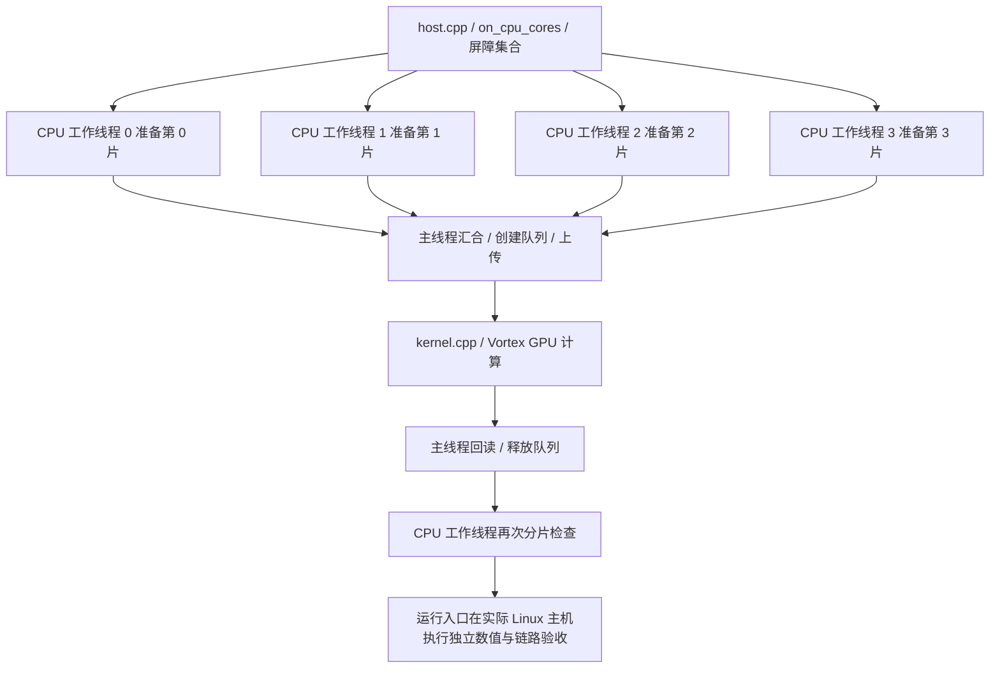

# 用户环境配置说明

## 1. 准备环境

使用 Linux x86-64，安装 Git、Bash、Python 3、curl、tar、make、patch 和基础 C/C++ 开发工具。建议至少 32 GB 内存，并为源码、编译缓存和波形预留充足磁盘空间。

把两个仓库放在同一层：

```text
工作目录/
├── axi_StorageStacked/
└── vortex_StorageStacked/
```

```bash
git clone https://github.com/hy2581/axi_StorageStacked.git
git clone https://github.com/hy2581/vortex_StorageStacked.git
cd vortex_StorageStacked
./build.sh --storage ../axi_StorageStacked --jobs 12
```

`build.sh` 保存依赖路径和编译并行度，准备固定版本工具，编译 gem5、Vortex、公共内存库和两个用户示例。源码随仓库交付，无需 submodule。首次准备工具需要网络；已有完整包缓存时可用 `SS_OFFLINE=1 ./build.sh`。

依赖路径相对于仓库根目录。复制源码到另一位置后重新执行 `build.sh`；工具与编译缓存由脚本管理。

## 2. 日常操作

```bash
cd user
./run.sh smoke
./run.sh llm
./run.sh smoke --output result/my-check
./run.sh llm --config config.json
```

项目名就是 `user/` 下的目录名。`--config` 和 `--output` 都相对于该项目目录；输出必须位于 `result/`，每次使用新目录。

```text
user/smoke/
├── config.json           全部项目配置
├── src/
│   ├── Makefile          声明源文件并调用 SDK
│   ├── host.cpp          gem5 CPU 程序
│   └── kernel.cpp        Vortex GPU 程序
└── result/               编译、运行、校验结果
```

用户维护 JSON 和 `src/` 即可。`run.sh` 读取 JSON，调用 Makefile，运行其生成的 `host.elf`、`program.vxbin`，保留 `program.elf` 和输出读取范围用于检查。

## 3. 修改配置

直接编辑 `smoke/config.json` 或 `llm/config.json`。下表列出默认值；同一项在两个项目中含义相同。

| 字段 | 默认值 | 用途 |
|---|---|---|
| `program.type` | `smoke` / `tiny_llm` | 程序与输出检查方式 |
| `program.input` | `41` | SMOKE 的 uint32 输入 |
| `program.workers` | `4` | SMOKE 工作组数，每组处理一个输入 |
| `program.prompt` | `"red "` | LLM 输入字符串，末尾空格也属于输入 |
| `program.generated_tokens` | `3` | LLM 生成 token 数 |
| `program.kv_cache` | `true` | 复用已计算的 K/V |
| `gpu.clock_mhz` | `1000` | GPU 时钟 |
| `gpu.cores` / `warps` / `threads` | `2` / `4` / `4` | GPU 核数、每核 warp 数、每个 warp 的线程数 |
| `gpu.l1i_bytes` / `l1d_bytes` | `16384` / `16384` | GPU 指令/数据缓存容量，字节 |
| `gpu.l2_enabled` / `l2_bytes` | `false` / `1048576` | GPU L2 开关和容量 |
| `host.clock_mhz` / `num_cpus` | `2000` / `4` | gem5 CPU 时钟和核心数量；示例的 CPU 工作线程总数随核心数变化 |
| `host.l1i` / `l1d` / `l2` | `32KiB` / `32KiB` / `1MiB` | 每核 L1I/L1D 与共享 L2 |
| `host.tlb_entries` | `64` | 每核 ITLB、DTLB 各自的条目数 |
| `axi.period_ns` | `2` | AXI 时钟周期 |
| `axi.outstanding` | `16` | 桥中同时处理的 TLM 请求上限 |
| `axi.planes` | `2` | 存储资源平面数 |
| `axi.stalls` / `replay` | `true` / `false` | 确定性反压、链路错误注入与重放 |
| `ucie.lanes` | `16` | UCIe lane 数 |
| `ucie.rate_gtps` | `24` | 每 lane 符号率，GT/s |
| `ucie.bits_per_symbol` | `1` | 每符号 bit 数，1 或 2 |
| `ucie.tat_ns` | `40` | 链路周转时间预算 |
| `memsim.standard` | `hbm4` | `hbm3`、`hbm4`、`lpddr5` 或 `lpddr6` |
| `memsim.channels` | `8` | 内存通道数量 |
| `memsim.scale` | `1` | 内存时序倍率；`4` 表示放慢为四倍 |
| `memsim.queue` / `slots` | `4` / `8` | 内部队列深度与在途 AXI burst 槽位 |
| `memsim.response_hold` | `0` | 内存响应额外等待周期，用于反压实验 |
| `simulation.max_ticks` | `20000000000000` | 仿真停止上限，单位 fs |

GPU 核数、warp 和线程数使用 1～32 的 2 的幂；工作组数为 1～256。CPU 数为 2～64。缓存容量、时钟和队列在运行前进行合法性检查。LLM 的 prompt 字符必须属于 `tinyllm.h` 中词表，prompt 长度加生成数减一不超过 16。

GPU 结构或 UCIe 参数改变时，运行入口自动更新对应平台；工作负载和时序参数随本次运行生效。首次构建和修改平台源码后，执行根目录 `./build.sh`。

## 4. 查看结果

每次运行打印 `PASS: 项目/result/运行目录/report.md`。打开该报告即可查看输入、输出、GPU 周期、事务数和验收结果。

| 文件 | 内容 |
|---|---|
| `input.json` / `resolved.json` | 用户配置快照 / 实际运行配置与模型输入 |
| `build/host.elf` / `build/program.elf` / `build/program.vxbin` | x86 CPU 程序 / RV32 GPU 程序 / GPU 加载镜像 |
| `build/programs.json` / `build/sources/` / `build.log` | 程序来源与执行位置 / 本次源码快照 / 编译日志 |
| `run.log` | CPU 的 `HOST_TASK` 分片记录、运行库、GPU 状态和实际回读字节 |
| `report.md` / `summary.json` | 阅读报告 / 机器可读验收结果 |
| `host_summary.json` / `stats.txt` | CPU 线程分工与每核执行核对 / 原始 gem5 统计 |
| `mmu_translations.csv` / `soc_summary.json` | 实际地址转换采样与缓存/TLB 统计 |
| `axi_wave.vcd` / `axi_events.csv` | 真实 AXI 五通道波形与握手 |
| `ucie_flits.csv` / `memsim_bridge.csv` | 链路 Flit 与在线内存请求/返回 |
| `memsim_view.html` | 可按请求查看的链路结果 |

通过要求是 `summary.json` 中 `passed: true`；失败会保留阶段和日志。HETTrace 用于区分主机、GPU 来源，实际信号以 VCD 和 `axi_events.csv` 为准。

## 5. 回归测试

```bash
# 在 user/ 中：
./run.sh smoke --test
./run.sh llm --test
# 在仓库根目录中：
./build.sh --test
```

测试包括 2/4 个 CPU 核的实际执行对照、正常运行、慢内存、uint32 回绕、CPU/GPU/缓存/TLB/UCIe 参数变更、KV cache 对照、重放、长 prompt，以及错误配置和篡改结果拒绝。每个设备场景仍保存在所属项目的 `result/`，汇总报告路径由测试入口打印。

## 6. CPU、GPU 分别跑什么，CPU 多核怎么看

### 6.1 两类源码、两种执行位置

每个项目的 `src/Makefile` 显式声明：

```make
HOST_SOURCES := host.cpp
KERNEL_SOURCES := kernel.cpp
```

`host.cpp` 编译为 x86-64 的 `host.elf`，在 gem5 模拟的 CPU 中执行。`kernel.cpp` 编译为 RV32 的 `program.elf`，打包成 `program.vxbin`，由主机通过 Vortex 运行库加载到 GPU。LLM 另有保存模型的 `tinyllm.h`。

gem5 在系统调用仿真模式（SE）下运行同一个 `host.elf` 进程，其中的 `on_cpu_cores()` 创建线程并用屏障集合；CPU 核在同一个 gem5 实例中执行这些线程。

### 6.2 分别配置 CPU 核、GPU 核与工作组

| 配置 | 控制什么 | 默认示例 |
|---|---|---|
| `host.num_cpus` | gem5 CPU 核数；两个示例的 CPU 工作线程总数也取该值 | 4：主线程加 3 个工作线程 |
| `gpu.cores` | Vortex GPU 硬件核心数 | 2，与 CPU 核数分别设置 |
| `program.workers` | SMOKE/custom 的 GPU 工作组数 | SMOKE 为 4；LLM 固定发射 1 个工作组、1 个线程 |

每个 CPU 核独立拥有 MMU、ITLB/DTLB 和 L1I/L1D，共享 L2。修改 `host.num_cpus` 后直接重新运行项目，入口会重新生成编译配置和主机程序。两核/四核对照命令见[SMOKE 指南第 7 节](02-用户从0开始添加SMOKE简要指南.md#7-比较四核和两核)。

### 6.3 多核实际分担的任务

默认四核时，SMOKE 每个线程准备一个输入；LLM 每个线程准备 251 个权重存储字。准备阶段结束后，主线程创建 Vortex 队列、上传数据、发射 GPU、回读结果。释放队列后再启动 CPU 工作线程，分别检查 SMOKE 输出或 LLM 权重回读。



本平台最少配置 2 个 CPU 核，因为 Vortex 运行库队列使用一个辅助线程。应用的全核分片阶段安排在队列创建前、销毁后，无需再额外增加一个 CPU 核。

### 6.4 查看多核执行证据

在 `user/` 中运行并查看：

```bash
./run.sh smoke --output result/multicore
cat smoke/result/multicore/report.md
cat smoke/result/multicore/host_summary.json
cat smoke/result/multicore/build/programs.json
```

`host_summary.json` 的主要字段如下：

| 字段 | 怎么看 |
|---|---|
| `configured_cpus` / `active_cpus` | 配置核数 / 实际提交过指令的核数，内置示例要求二者相等 |
| `cores[].cpu` / `instructions` | 核编号 / 该核实际提交指令数 |
| `cores[].l1i_accesses` / `l1d_accesses` / `translation_samples` | 每核指令缓存、数据缓存访问和 MMU 翻译样本数，要求均大于 0 |
| `phases.prepare` / `phases.check` | 准备和检查两个阶段；每条记录保存工作线程编号 `worker`、实际线程 ID `tid`、处理区间 `[begin, end)` |
| `host_check_errors` / `passed` | CPU 回读检查错误数为 0，且上述执行与分片检查通过 |

`worker` 是程序中的任务编号；`cores[].cpu` 是模拟核编号。两类记录分别说明任务如何划分、各核是否实际执行。每核指令数覆盖整个主机进程的计算、运行库和同步，不是单个分片的指令数。MMU 字段是有限采样数，不是全部访存次数。

已保存的[四核记录](../third_party/validation/2026-09-26-host-device/cases/smoke/host_summary.json)和[两核记录](../third_party/validation/2026-09-26-host-device/cases/smoke_cpu2/host_summary.json)可直接对照：

| SMOKE 配置 | 实际活跃核 | 各核提交指令数，按 CPU 编号排列 | 每个 CPU 工作线程处理的输入数 |
|---|---:|---|---:|
| 4 核，4 个 GPU 工作组 | 4 | 2372814、38287、8220、6215 | 1 |
| 2 核，4 个 GPU 工作组 | 2 | 2356535、38780 | 2 |

两次输出均为 `42`，CPU 检查均为零错误；上表是已保存验收记录，重新运行的统计以本次结果为准。新增应用需要在主机代码中创建线程才能分担工作；主线程还承担加载和发射，各核工作量无需相等，核数增加也不保证短程序线性加速。整个项目是否通过仍以 `summary.json` 的 `passed: true` 为准。
