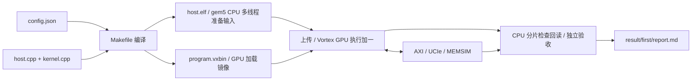

# 用户从 0 开始添加 SMOKE 简要指南

[文档目录](README.md) · 按需查参数，第一次使用先看目录中的入门或配置实验。

先在仓库根目录执行一次 `./build.sh`。下面所有命令在 `user/` 中执行。

## 1. 新建项目目录

```bash
mkdir -p my_smoke/src
```

## 2. 保存项目配置

复制完整平台配置，选择 4 个 CPU 核、2 个 GPU 核、4 个 GPU 工作组，输入为 41：

```bash
cp smoke/config.json my_smoke/config.json
python3 - <<'PY'
import json
from pathlib import Path
p=Path('my_smoke/config.json')
c=json.loads(p.read_text())
c['program']={'type':'smoke','input':41,'workers':4}
c['host']['num_cpus']=4
c['gpu']['cores']=2
p.write_text(json.dumps(c,indent=2)+'\n')
PY
```

需要修改 GPU、CPU/MMU/缓存、AXI、UCIe 或 MEMSIM 时，直接改这一个 JSON。完整字段见[环境配置说明](01-用户环境配置说明.md)。写 JSON 是在磁盘上保存配置文件；运行 `host.elf` 后，CPU 才会准备输入并通过运行库上传到模拟存储。

## 3. 准备 CPU 和 GPU 两份源码

复制可直接阅读的 CPU 程序。它创建多个线程准备输入，通过 Vortex API 上传和发射，回读后再分片检查：

```bash
cp smoke/src/host.cpp my_smoke/src/host.cpp
```

编写 GPU 程序，只负责读取 CPU 已上传的输入、加一和写回：

```bash
cat > my_smoke/src/kernel.cpp <<'CPP'
#include "project_config.h"
#include <vx_spawn2.h>
#include <cstdint>

__kernel void kernel_main() {
    const unsigned index = blockIdx.x;
    volatile uint32_t *input = (volatile uint32_t *)0x90000000u;
    volatile uint32_t *output = (volatile uint32_t *)0x90010000u;
    volatile uint32_t *status = (volatile uint32_t *)0x9005000cu;
    const uint32_t value = input[index];
    output[index] = value + 1u;
    const uint32_t returned = output[index];
    if (index == 0)
        *status = returned == value + 1u ? 0x600d0000u : 0xbad00001u;
}
CPP
```

每个 GPU 工作组读取输入、加一、写入输出、再读回。`project_config.h` 由 SDK 根据本次 JSON 生成，无需手写。地址是 GPU 程序使用的地址，外部请求经 gem5 映射进入公共存储窗口。

## 4. 编写 Makefile

```bash
cat > my_smoke/src/Makefile <<'MAKE'
HOST_SOURCES := host.cpp
KERNEL_SOURCES := kernel.cpp
SDK := ../../../third_party/vortex/sdk
include $(SDK)/app.mk
MAKE
```

Makefile 明确声明两类源码：`host.cpp` 生成 x86-64 的 `host.elf`，在 gem5 CPU 执行；`kernel.cpp` 生成 RV32 的 `program.elf` 和 `program.vxbin`，在 Vortex GPU 执行。

## 5. 运行

```bash
./run.sh my_smoke --output result/first
```

无需修改 `run.sh` 或登记项目名。入口自动读取 `my_smoke/config.json` 和 `my_smoke/src/Makefile`。

## 6. 看输出

```bash
cat my_smoke/result/first/report.md
cat my_smoke/result/first/smoke_summary.json
cat my_smoke/result/first/host_summary.json
```

预期为输入 `41`、输出 `42`、`workers: 4`、`passed: true`，四个工作组的输出均被独立检查。默认四个 CPU 核应均有提交指令、L1 访问和 MMU 样本；报告直接列出各核数据。



## 7. 比较四核和两核

只把 CPU 核数改为 2，GPU 核数和 4 个工作组保持上面的配置：

```bash
python3 - <<'PY'
import json
from pathlib import Path
p=Path('my_smoke/config.json')
c=json.loads(p.read_text())
c['host']['num_cpus']=2
p.write_text(json.dumps(c,indent=2)+'\n')
PY
./run.sh my_smoke --output result/cpu2
python3 - <<'PY'
import json
from pathlib import Path
for name in ('first', 'cpu2'):
    h=json.loads((Path('my_smoke/result')/name/'host_summary.json').read_text())
    print(name, '配置核数:', h['configured_cpus'], '活跃核数:', h['active_cpus'])
    print('每核指令:', [c['instructions'] for c in h['cores']])
    print('准备分片:', [(w['begin'], w['end']) for w in h['phases']['prepare']])
    print('CPU 检查错误:', h['host_check_errors'])
PY
```

预期：`first` 为 4 个活跃 CPU 核，分片为 `[0,1)`、`[1,2)`、`[2,3)`、`[3,4)`；`cpu2` 为 2 个活跃 CPU 核，分片为 `[0,2)`、`[2,4)`。两次输出均为 42、检查错误数均为 0。每核指令数以实际运行为准；字段说明见[环境配置说明第 6 节](01-用户环境配置说明.md#6-cpugpu-分别跑什么cpu-多核怎么看)。后续运行使用修改后的两核配置。

## 8. 添加自己的计算

保留同样目录结构，修改 `src/` 和 Makefile；把 `program.type` 改为 `custom`，用 `defines` 提供整数宏、`expect` 提供输出地址与期望值。例如：

```json
{
"program": {
  "type": "custom",
  "workers": 1,
  "defines": {"INPUT": 41},
  "expect": [{"address": "0x90010000", "value": 42}]
}
}
```

自定义项目也必须提供 `host.cpp` 和 `kernel.cpp`。根据自己的输入输出修改 CPU 的准备、上传和检查代码，不能原样复用只检查 SMOKE 的主机逻辑。设备可通过 `APP_INPUT` 读取该输入，把结果写入期望地址，最后向 `0x9005000c` 写 `0x600d0000`。用户数据区为 `0x90000000`～`0x9005ffff`；输出字地址须 4 字节对齐。成功状态之后还会逐字检查真实返回数据和完整链路。

## 把地址、指针和数据串起来

`uint32_t` 是占 4 字节的无符号整数类型。
`0x90000000` 是地址，41 是这个地址里要保存的数，两者含义不同。

例如第 2 组的 `index=2`：`input[2]` 位于 `0x90000000 + 2×4 = 0x90000008`，
`output[2]` 位于 `0x90010008`。默认四组读取的都是 41，各自写回 42。
CPU 上传数组、GPU 处理数组、CPU 回读检查是三个阶段；第 0 组写了成功标志，也仍需检查其他组。

`volatile` 告诉编译器保留这里的读写操作。实际传输还受设备接口、缓存和桥接粒度影响，
每条语句不一定对应一笔独立的外部 AXI 请求。应到本次日志中查看请求数。

## 先做这三个小检查

1. **不改运算，只改输入**：输入 100，预期 101，运行后看 `smoke_summary.json`。
2. **检查回绕**：输入 4294967295，32 位加一后预期为 0。
3. **检查自己没有看错目录**：打开本次 `input.json`，确认里面保存的是这次输入。

如果把源代码改成“加二”却仍使用 `program.type="smoke"`，固定 SMOKE 校验会拒绝。
自己定义算法时同时设计 `custom` 的输入、输出地址和期望值；
完整路径规则和实验命令见 [配置实验与 USER 负载详解](06-配置实验与USER负载详解.md)。
