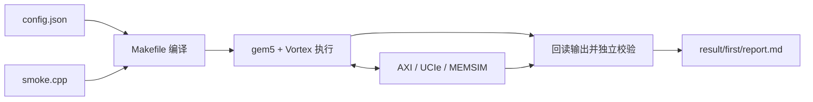

# 用户从 0 开始添加 SMOKE 简要指南

先在仓库根目录执行一次 `./build.sh`。下面所有命令在 `user/` 中执行。

## 1. 新建项目目录

```bash
mkdir -p my_smoke/src
```

## 2. 保存项目配置

复制完整平台配置，然后修改输入值和工作组数：

```bash
cp smoke/config.json my_smoke/config.json
python3 - <<'PY'
import json
from pathlib import Path
p=Path('my_smoke/config.json')
c=json.loads(p.read_text())
c['program']={'type':'smoke','input':41,'workers':4}
p.write_text(json.dumps(c,indent=2)+'\n')
PY
```

需要修改 GPU、CPU/MMU/缓存、AXI、UCIe 或 MEMSIM 时，直接改这一个 JSON。完整字段见[环境配置说明](01-用户环境配置说明.md)。写 JSON 是在磁盘上保存配置文件；设备程序运行后才会向模拟内存写数据。

## 3. 编写设备程序

```bash
cat > my_smoke/src/smoke.cpp <<'CPP'
#include "project_config.h"
#include <vx_spawn2.h>
#include <cstdint>

__kernel void kernel_main() {
    const unsigned index = blockIdx.x;
    volatile uint32_t *input = (volatile uint32_t *)0x90000000u;
    volatile uint32_t *output = (volatile uint32_t *)0x90010000u;
    volatile uint32_t *status = (volatile uint32_t *)0x9005000cu;
    input[index] = SMOKE_INPUT;
    const uint32_t value = input[index];
    output[index] = value + 1u;
    const uint32_t returned = output[index];
    if (index == 0)
        *status = returned == SMOKE_INPUT + 1u ? 0x600d0000u : 0xbad00001u;
}
CPP
```

每个工作组写入输入、读回、加一、写入输出、再读回。`project_config.h` 由 SDK 根据本次 JSON 生成，无需手写。地址是 GPU 程序使用的地址，外部请求经 gem5 映射进入公共存储窗口。

## 4. 编写 Makefile

```bash
cat > my_smoke/src/Makefile <<'MAKE'
SOURCES := smoke.cpp
SDK := ../../../third_party/sdk
include $(SDK)/app.mk
MAKE
```

Makefile 声明源文件，SDK 负责设备编译和配套主机运行程序。

## 5. 运行

```bash
./run.sh my_smoke --output result/first
```

无需修改 `run.sh` 或登记项目名。入口自动读取 `my_smoke/config.json` 和 `my_smoke/src/Makefile`。

## 6. 看输出

```bash
cat my_smoke/result/first/report.md
cat my_smoke/result/first/smoke_summary.json
```

预期为输入 `41`、输出 `42`、`workers: 4`、`passed: true`，四个工作组的输出均被独立检查。



## 7. 添加自己的计算

保留同样目录结构，修改 `src/` 和 Makefile；把 `program.type` 改为 `custom`，用 `defines` 提供整数宏、`expect` 提供输出地址与期望值。例如：

```json
"program": {
  "type": "custom",
  "workers": 1,
  "defines": {"INPUT": 41},
  "expect": [{"address": "0x90010000", "value": 42}]
}
```

设备通过 `APP_INPUT` 读取该输入，把结果写入期望地址，最后向 `0x9005000c` 写 `0x600d0000`。用户数据区为 `0x90000000`～`0x9005ffff`；输出字地址须 4 字节对齐。成功状态之后还会逐字检查真实返回数据和完整链路。
