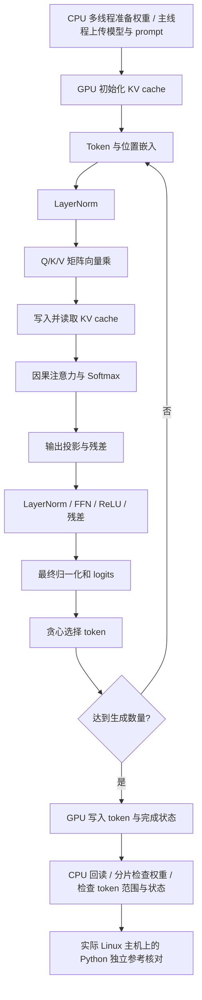
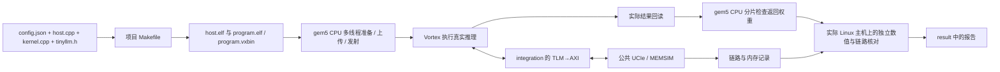

# LLM 简要说明

## 1. 文件和输入

```text
user/llm/
├── config.json
├── src/
│   ├── Makefile
│   ├── tinyllm.h
│   ├── host.cpp
│   └── kernel.cpp
└── result/
```

| 文件 | 执行位置与阅读顺序 |
|---|---|
| [host.cpp](../user/llm/src/host.cpp) | 编译为 `host.elf`，由 gem5 x86 CPU 执行：`on_cpu_cores()` 分片准备权重 → `vx_enqueue_write()` 上传权重和 prompt → `vx_enqueue_launch()` 发射 GPU → `readback_all()` 回读 → 分片检查 |
| [kernel.cpp](../user/llm/src/kernel.cpp) | 编译为 `program.elf / program.vxbin`，由 Vortex 执行：从 `kernel_main()` 看整体流程，再看 `forward()`、`norm()`、`linear()` |
| [tinyllm.h](../user/llm/src/tinyllm.h) | 两份程序共用的模型定义：参数、权重、词表和布局 |
| [Makefile](../user/llm/src/Makefile) | `HOST_SOURCES` 指定 CPU 源码，`KERNEL_SOURCES` 指定 GPU 源码，`MODEL_HEADER` 指定模型头文件 |

模型与 CoralNPU 示例一致，计算流程也保持对应，设备入口和数学函数使用 Vortex SDK。

模型为单层字符 Transformer：1001 个参数，隐藏维度 8、2 个注意力头、FFN 维度 16、上下文 16、词表 17。头文件中权重按对齐布局保存，共 1004 个 float。用户不需要下载模型、运行训练程序或生成权重文件。

日常修改 `config.json`：

```json
"program": {
  "type": "tiny_llm",
  "prompt": "red ",
  "generated_tokens": 3,
  "kv_cache": true
}
```

其余 GPU、CPU/MMU/缓存、AXI、UCIe、MEMSIM 参数也在同一 JSON 中，见[环境配置说明](01-用户环境配置说明.md)。

## 2. 程序做什么



CPU 程序负责准备和传输输入；GPU 程序分三段：初始化 KV cache；第一轮 prefill、后续 decode；写入结果和完成状态。`forward()` 包含一整个位置的计算，`norm()`、`linear()` 等小函数对应基本算子。

开启 KV cache 后，第一轮处理完整 prompt，后续每轮只计算新位置。关闭后每轮重算当前前缀。两种方式应生成相同 token，可用来观察访存和执行周期差异。

推理在 GPU 内核中执行，使用 FP32。SDK 提供单精度平方根和 Softmax 所需指数函数。仿真完成后，运行入口在实际 Linux 主机上执行 Python 参考程序，以 FP64 独立重算完整前缀并核对设备实际输出；这部分属于验收，不计入模拟 CPU 的执行统计。

CPU 默认四核；准备与回读检查两个阶段都按下表分工。`host.cpp` 的 `on_cpu_cores()` 用 `std::thread` 和屏障执行这些任务，主线程还负责上传与发射。

| 工作线程编号 | 权重存储字下标，左闭右开 | 数量 |
|---|---|---:|
| 0 | `[0, 251)` | 251 |
| 1 | `[251, 502)` | 251 |
| 2 | `[502, 753)` | 251 |
| 3 | `[753, 1004)` | 251 |

修改 `host.num_cpus` 会重新划分这 1004 个存储字。当前简明 LLM 内核发射 1 个 GPU 工作组、1 个线程，完整 Transformer 在 GPU 中计算；CPU 多核负责输入准备和返回权重检查。

## 3. 外部数据布局

| GPU 地址 | 数据 | 谁写入 |
|---|---|---|
| `0x90000000` | 运行时权重 | CPU 上传，GPU 读取 |
| `0x90010000` | Key cache | GPU 初始化并在推理中更新 |
| `0x90020000` | Value cache | GPU 初始化并在推理中更新 |
| `0x90030000` | 每个位置的中间结果 | GPU 写入 |
| `0x90040000` | prompt 和后续输入 token | CPU 上传 prompt；GPU 追加后续输入 token |
| `0x90050000` | 初始化、阶段标记、生成 token、前向次数、完成状态 | GPU 写入，CPU 回读 |

GPU 的外部缓存请求经过 gem5 timing 路径，再进入 AXI/UCIe/MEMSIM。缓存命中由 GPU 缓存处理；缓存之外的请求和返回会进入原始链路记录。

## 4. 运行和输出

```bash
# 在 user/ 中执行
./run.sh llm --output result/first
cat llm/result/first/report.md
cat llm/result/first/llm_summary.json
cat llm/result/first/host_summary.json
```

默认输入 `"red "`，生成 `"blu"`，token ID 为 `[4, 10, 15]`。这是三次生成的输出；与 prompt 连起来为 `"red blu"`。

`llm_summary.json` 保存生成结果、前向计算次数、逐阶段检查数量与最大误差。验收会核对：

- 实际回读字节与在线内存最终值一致。
- 权重逐字节一致；KV 和中间结果与独立参考一致。
- prompt、生成 token、前向次数和完成状态正确。
- AXI、Flit、MEMSIM 和 VCD 之间的数据、顺序、时刻一致。

默认 KV cache 打开，处理 6 个位置；关闭后按 4、5、6 个位置重算，共 15 次前向位置计算。两个配置的输出 token 应一致。

CPU 分工看 `host_summary.json` 的 `phases.prepare`、`phases.check`；每核实际执行看 `cores` 和 `active_cpus`。源码与二进制对应关系看 `build/programs.json`，完整字段说明见[环境配置说明第 6 节](01-用户环境配置说明.md#6-cpugpu-分别跑什么cpu-多核怎么看)。

## 5. 完整流程



已保存的[LLM 验收记录](../third_party/validation/2026-09-26-host-device/cases/llm/summary.json)和[CPU 分工记录](../third_party/validation/2026-09-26-host-device/cases/llm/host_summary.json)对应四核实际执行及默认 `"red " → "blu"`；新运行的结果写入上面指定的 `result/first/`。
