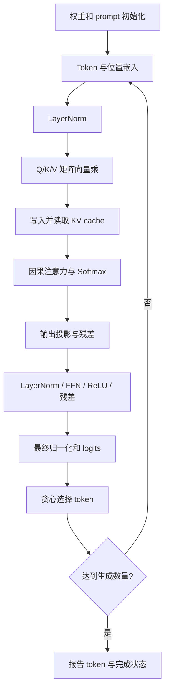
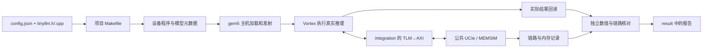

# LLM 简要说明

## 1. 文件和输入

```text
user/llm/
├── config.json
├── src/
│   ├── Makefile
│   ├── tinyllm.h
│   └── tinyllm.cpp
└── result/
```

`tinyllm.h` 保存模型参数、权重、词表和布局；`tinyllm.cpp` 执行推理；Makefile 声明两者。模型与 CoralNPU 示例一致，计算流程也保持对应，设备入口和数学函数使用 Vortex SDK。

模型为单层字符 Transformer：1001 个参数，隐藏维度 8、2 个注意力头、FFN 维度 16、上下文 16、词表 17。头文件中权重按对齐布局保存，共 1004 个 float。用户不需要下载模型、运行训练程序或生成权重文件。

日常修改 `config.json`：

```json
"program": {
  "type": "tiny_llm",
  "prompt": "red ",
  "generated_tokens": 3,
  "kv_cache": true
}
```

其余 GPU、CPU/MMU/缓存、AXI、UCIe、MEMSIM 参数也在同一 JSON 中，见[环境配置说明](01-用户环境配置说明.md)。

## 2. 程序做什么



程序分三段：初始化模型和外部缓冲区；第一轮 prefill、后续 decode；写入结果和完成状态。`forward()` 包含一整个位置的计算，`norm()`、`linear()` 等小函数对应基本算子。

开启 KV cache 后，第一轮处理完整 prompt，后续每轮只计算新位置。关闭后每轮重算当前前缀。两种方式应生成相同 token，可用来观察访存和执行周期差异。

推理在 GPU 内核中执行，使用 FP32。SDK 提供单精度平方根和 Softmax 所需指数函数；Python 参考实现独立使用完整前缀计算，核对设备实际输出。

## 3. 外部数据布局

| GPU 地址 | 数据 |
|---|---|
| `0x90000000` | 运行时权重 |
| `0x90010000` | Key cache |
| `0x90020000` | Value cache |
| `0x90030000` | 每个位置的中间结果 |
| `0x90040000` | prompt 和后续输入 token |
| `0x90050000` | 初始化、阶段标记、生成 token、前向次数、完成状态 |

GPU 的外部缓存请求经过 gem5 timing 路径，再进入 AXI/UCIe/MEMSIM。缓存命中由 GPU 缓存处理；缓存之外的请求和返回会进入原始链路记录。

## 4. 运行和输出

```bash
# 在 user/ 中执行
./run.sh llm --output result/first
cat llm/result/first/report.md
cat llm/result/first/llm_summary.json
```

默认输入 `"red "`，生成 `"blu"`，token ID 为 `[4, 10, 15]`。这是三次生成的输出；与 prompt 连起来为 `"red blu"`。

`llm_summary.json` 保存生成结果、前向计算次数、逐阶段检查数量与最大误差。验收会核对：

- 实际回读字节与在线内存最终值一致。
- 权重逐字节一致；KV 和中间结果与独立参考一致。
- prompt、生成 token、前向次数和完成状态正确。
- AXI、Flit、MEMSIM 和 VCD 之间的数据、顺序、时刻一致。

默认 KV cache 打开，处理 6 个位置；关闭后按 4、5、6 个位置重算，共 15 次前向位置计算。两个配置的输出 token 应一致。

## 5. 完整流程


