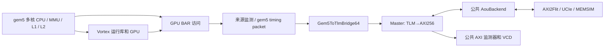
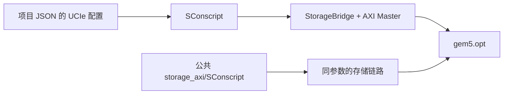
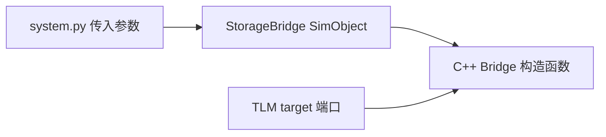
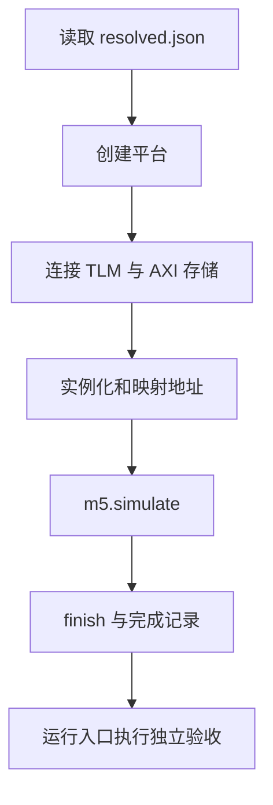
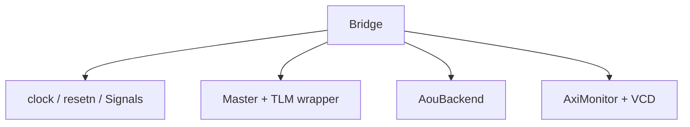
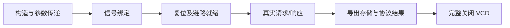
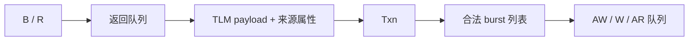
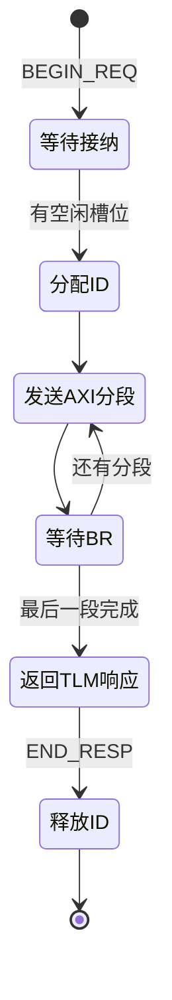

# integration 介绍

`integration/` 把 gem5/Vortex 的时序请求接入独立的 `axi_StorageStacked`。CPU、MMU、缓存、GPU 执行和工具由平台提供；本目录集中处理外部端口、请求生命周期和 AXI 信号转换。

```text
integration/
├── SConscript
├── StorageBridge.py
├── system.py
├── storage.hh
├── storage.cc
├── axi_master.hh
└── axi_master.cc
```



## 1. SConscript

注册 `StorageBridge` SimObject，编译 `axi_master.cc`、`storage.cc`，加入公共存储头文件路径。

UCIe 的 lane、速率、调制和周转预算由项目 JSON 转成编译定义；只作用于相关源文件。公共 AXI 存储源码由其自己的 `storage_axi/SConscript` 编译。两部分使用 gem5 自带的一套 SystemC。



## 2. StorageBridge.py

定义 gem5 可见的存储桥：TLM target 端口、AXI 周期、在途上限、存储地址窗口、平面数、重放开关，以及 MEMSIM 的标准、通道、队列和时序参数。

`finish()` 是仿真结束时导出完整结果的接口。64 bit TLM socket 是上层绑定规格；AXI 数据总线实际为 256 bit。



## 3. system.py

读取本次 `resolved.json`，调用平台创建 CPU、MMU、缓存、GPU，再连接公共存储桥。`host_binary` 指向 CPU 执行的 `host.elf`，`kernel` 指向主机要加载的 `program.vxbin`；CPU/GPU 两份用户源码分别在项目的 `src/host.cpp`、`src/kernel.cpp`。流程为：

1. 创建 gem5/Vortex 平台，统一时间单位为 1 fs。
2. 配置存储窗口、AXI 时钟和 MEMSIM 参数。
3. 连接来源监测器、gem5/TLM 转换器与 `StorageBridge`。
4. 为主机运行库映射 CP 寄存器和 GPU BAR。
5. 运行设备程序，检查退出原因，结束后导出 `completion.json`。

数值、协议、Flit、内存和波形验收由运行入口继续执行。



## 4. storage.hh

声明 `Bridge` 模块，管理 AXI 信号、时钟、复位、Master、公共存储实例、TLM 包装端口、公共监测器和 VCD。



## 5. storage.cc

实现模块装配与生命周期：绑定五通道，等待复位和链路训练，安装 packet 到 TLM 的字节使能及来源属性转换，记录实际编译的 UCIe 参数。

`checkClock()` 确认 SystemC 时刻与 gem5 tick 一致。`finish()` 导出存储结果与协议摘要，并补记结束时刻的信号值后关闭 VCD。



## 6. axi_master.hh

定义 TLM→AXI Master 的接口与事务状态。`RequestAttributes` 保留字节掩码、requestor、stream/substream 和 payload 延迟；`Txn` 保存一次请求的 ID、分段、拍号及关键时刻。

队列分别管理 AW、W、AR 和返回，避免把 AXI 五通道简化成一次同步函数调用。



## 7. axi_master.cc

实现请求收发状态机：

- `transport()` 接收非阻塞 TLM 请求，保留请求直到对应响应被接受。
- `admit()` 受在途槽位限制分配活跃 ID。
- `split()` 将请求按对齐、256 拍上限和 4 KiB 边界拆分。
- `drive()` 驱动 VALID、地址、数据、掩码和 LAST；遇到反压保持负载。
- B/R 握手后回收数据、推进分段；全部完成后返回 TLM 响应。
- `transactions.csv` 记录请求、接纳、AXI 完成和响应结束时刻。



`integration` 负责产生和接收 AXI 信号；AXI2Flit、UCIe 和内存调度仍由公共项目统一提供。两个驱动以同一接口契约接入各自的公共存储实例。
