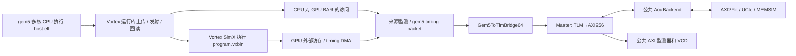
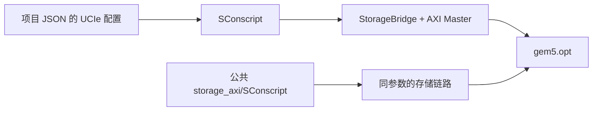
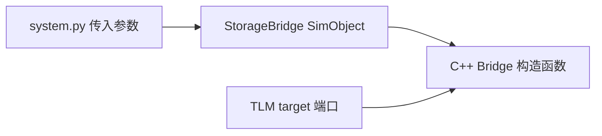
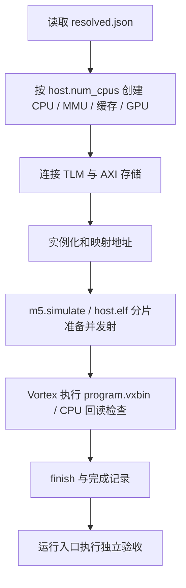
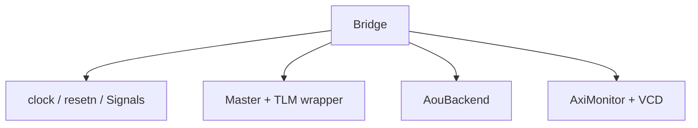
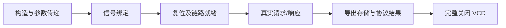
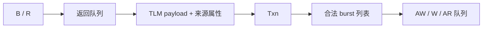
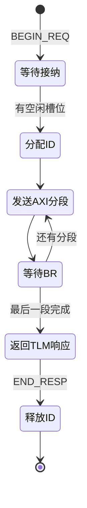

# integration 介绍

[返回文档目录](README.md)。

`integration/` 把 gem5/Vortex 的时序请求接入独立的 `axi_StorageStacked`。CPU、MMU、缓存、GPU 执行和工具由平台提供；本目录集中处理外部端口、请求生命周期和 AXI 信号转换。

```text
integration/
├── SConscript
├── StorageBridge.py
├── system.py
├── storage.hh
├── storage.cc
├── axi_master.hh
└── axi_master.cc
```



## 1. SConscript

注册 `StorageBridge` SimObject，编译 `axi_master.cc`、`storage.cc`，加入公共存储头文件路径。

UCIe 的 lane、速率、调制和周转预算由项目 JSON 转成编译定义；只作用于相关源文件。公共 AXI 存储源码由其自己的 `storage_axi/SConscript` 编译。两部分使用 gem5 自带的一套 SystemC。



## 2. StorageBridge.py

定义 gem5 可见的存储桥：TLM target 端口、AXI 周期、在途上限、存储地址窗口、平面数、重放开关，以及 MEMSIM 的标准、通道、队列和时序参数。

`finish()` 是仿真结束时导出完整结果的接口。64 bit TLM socket 是上层绑定规格；AXI 数据总线实际为 256 bit。



## 3. system.py

读取本次 `resolved.json`，调用平台创建 CPU、MMU、缓存、GPU，再连接公共存储桥。`host_binary` 指向 CPU 执行的 `host.elf`，`kernel` 指向主机要加载的 `program.vxbin`；CPU/GPU 两份用户源码分别在项目的 `src/host.cpp`、`src/kernel.cpp`。

平台 `third_party/gem5/runtime/soc.py` 按 `host.num_cpus` 创建多个 `TimingSimpleCPU`，在 SE 模式下共同执行一个主机进程；工作线程由用户的 `host.cpp` 创建。各核使用私有 MMU/L1、共享 L2，主机代码、栈和堆访问主机内存；GPU BAR 和 GPU 外部访存连接本目录的存储桥。流程为：

1. 创建 gem5/Vortex 平台，统一时间单位为 1 fs。
2. 配置存储窗口、AXI 时钟和 MEMSIM 参数。
3. 连接来源监测器、gem5/TLM 转换器与 `StorageBridge`。
4. 为主机运行库映射 CP 寄存器和 GPU BAR。
5. gem5 执行 `host.elf`，主机调用 Vortex 运行库加载和启动 `program.vxbin`；检查退出原因，结束后导出 `completion.json`。

运行入口随后执行每核活动与线程分片检查，生成 `host_summary.json`，并继续数值、协议、Flit、内存和波形验收。`completion.json` 记录仿真结束，整体通过状态看 `summary.json`。



## 4. storage.hh

声明 `Bridge` 模块，管理 AXI 信号、时钟、复位、Master、公共存储实例、TLM 包装端口、公共监测器和 VCD。



## 5. storage.cc

实现模块装配与生命周期：绑定五通道，等待复位和链路训练，安装 packet 到 TLM 的字节使能及来源属性转换，记录实际编译的 UCIe 参数。

`checkClock()` 确认 SystemC 时刻与 gem5 tick 一致。`finish()` 导出存储结果与协议摘要，并补记结束时刻的信号值后关闭 VCD。



## 6. axi_master.hh

定义 TLM→AXI Master 的接口与事务状态。`RequestAttributes` 保留字节掩码、requestor、stream/substream 和 payload 延迟；`Txn` 保存一次请求的 ID、分段、拍号及关键时刻。

队列分别管理 AW、W、AR 和返回，避免把 AXI 五通道简化成一次同步函数调用。



## 7. axi_master.cc

实现请求收发状态机：

- `transport()` 接收非阻塞 TLM 请求，保留请求直到对应响应被接受。
- `admit()` 受在途槽位限制分配活跃 ID。
- `split()` 将请求按对齐、256 拍上限和 4 KiB 边界拆分。
- `drive()` 驱动 VALID、地址、数据、掩码和 LAST；遇到反压保持负载。
- B/R 握手后回收数据、推进分段；全部完成后返回 TLM 响应。
- `transactions.csv` 记录请求、接纳、AXI 完成和响应结束时刻。



`integration` 负责产生和接收 AXI 信号；AXI2Flit、UCIe 和内存调度仍由公共项目统一提供。两个驱动以同一接口契约接入各自的公共存储实例。

## 跟着一笔读请求读源码

可以把“桥接”理解成翻译：上游说“读这个地址的若干字节”，桥把它转换成 AXI 信号，
等存储返回后再把字节交回上游。一次调用发起请求，不代表数据已经返回。

例如从 `0x90000000` 起读 12 字节：`Master::split` 先安排 8 字节，再安排 4 字节，
构成两个 AXI burst。`transactions.csv` 仍是一笔 TLM 事务，但 `segments=2`；
对照 AXI 的 AR 数时应统计分段数。`END_REQ` 表示请求已接纳，`END_RESP` 才是响应交接结束。

| 到哪个阶段 | 应观察什么 |
|---|---|
| 上游发出请求 | 地址、读写方向、长度、来源 ID |
| 桥正式接收 | 是否还有在途容量、分配了哪个 AXI ID |
| 地址握手 | `ARVALID && ARREADY` 的时钟上升沿 |
| 数据握手 | `RVALID && RREADY`；核对 ID、字节、响应码、末拍 |
| 上游收到完成 | 返回时间与数据；此后才释放相应事务资源 |

“反压”就是接收方暂时忙，要求发送方等一等。
波形上 `VALID=1, READY=0` 表示正在等；`VALID=1, READY=1` 才传走一拍。
AW/W 可以分别等待，写地址握手不表示写操作完成，还要等 B 响应。

## 遇到问题，定位到具体文件

| 问题 | 首先阅读 |
|---|---|
| JSON 参数看似没生效 | `resolved.json` 和本目录的参数填充代码 |
| 请求进了桥，却没有 AXI 地址 | `axi_master.cc` 的容量判断、复位与发送队列 |
| 返回字节位置不对 | `axi_master.cc` 的 lane 和掩码转换 |
| 仿真末尾还有在途请求 | 完成处理、队列释放和 `finish` 的调用顺序 |
| VCD 找不到关键信号 | `storage.cc` 的 trace 注册和波形关闭 |

修改本目录后回根目录重新构建。数值结果和存储链路都应重新核对，
不能用一次编译成功证明时序和返回数据正确。
