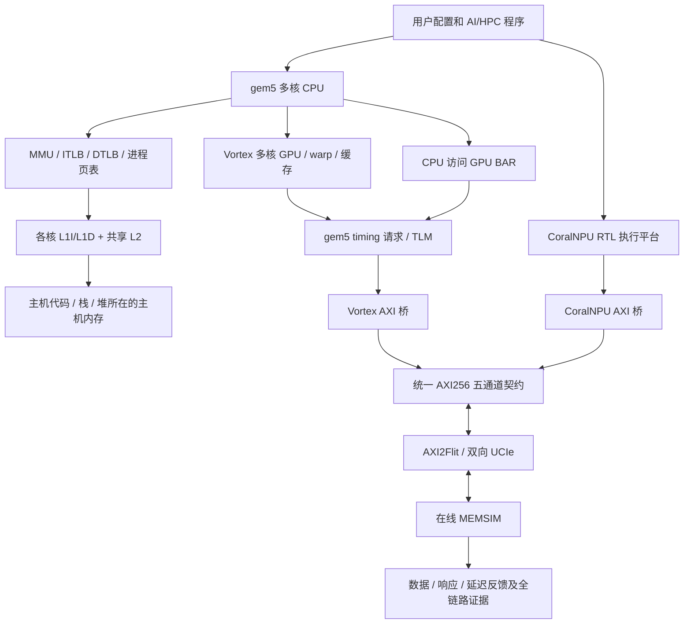
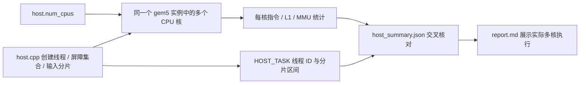
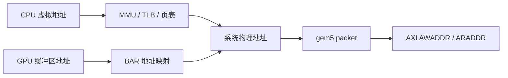

# 研究成果一：SoC 侧仿真模型分析

[返回文档目录](README.md)。

研究成果一要求：**基于 GEM5 搭建 SoC 侧仿真模型，包含多核计算核（CPU/GPU/NPU）、MMU 内存管理单元和多级缓存，执行 AI/HPC 负载，产生虚实地址转换及具有负载特征的 AXI 访存请求，为全链路提供输入。**

三个项目分别做三件事：Vortex 项目运行 CPU 和 GPU 程序，CoralNPU 项目运行 NPU 程序；
它们发出的读写请求都交给 AXI 存储项目。存储项目处理请求，再返回数据和等待时间。

两种计算平台分别驱动公共存储的独立实例，统一输入输出契约使 CPU/GPU 与 NPU 负载能够使用同一套链路、内存模型和验收方法。

## 1. 基于 GEM5 搭建

Vortex 平台在 gem5 中实例化 `System`、多核 `TimingSimpleCPU`、缓存层级、互连、Vortex 设备和 SystemC 存储桥。用户的 `host.cpp` 编译为 x86-64 `host.elf`，在 gem5 CPU 上执行输入准备、运行库调用和结果检查；`kernel.cpp` 编译为 RV32 `program.elf / program.vxbin`，由 Vortex SimX 执行 GPU 指令并推进缓存行为。

gem5 事件队列按 GPU 周期调度设备。设备外部访存通过 `dmaRead`、`dmaWrite` 发出 timing 请求，经 TLM 转成真实 AXI 信号。CPU、GPU、桥与存储使用统一的 1 fs 时间基准，响应时刻参与后续计算推进。

实现入口：`integration/system.py`；平台封装：`third_party/gem5/runtime/soc.py`；运行证据：`config.json`、`completion.json`、`run.log`。

## 2. 多核计算核：CPU、GPU、NPU

| 组成 | 实现方式 | 用户配置与实际观测 |
|---|---|---|
| CPU | gem5 多个 TimingSimpleCPU，共享主机进程执行环境，每核独立 MMU 与 L1 | `host.num_cpus`、`host.clock_mhz`；gem5 实例配置及统计 |
| GPU | Vortex 多核、warp 和线程组织，运行编译后的设备程序 | `gpu.cores`、`warps`、`threads`、`clock_mhz`；加载库配置与 GPU 周期统计 |
| NPU | CoralNPU RTL 执行 RISC-V 设备程序，原生异步存储接口接入同一 AXI 契约 | CoralNPU 用户 JSON、设备程序、RTL 执行和 `npu_requests.csv` |

Vortex 默认提供 4 个 CPU 核、2 个 GPU 核，每核 4 个 warp、每 warp 4 线程。两个项目的 `host.cpp` 创建 CPU 工作线程，分片准备输入和检查回读；`kernel.cpp` 在 GPU 上执行。SMOKE 用多个 GPU 工作组产生可控读写；TinyLLM 在设备端执行完整字符解码计算。GPU 结构参数变化会触发设备平台更新，并由运行日志与配置核对实际生效值。

CPU 多核由三个层次共同体现：JSON 的 `host.num_cpus` 创建多个独立 CPU 实例；用户 `host.cpp` 的线程与屏障分派实际工作；结果中的 `host_summary.json`、`stats.txt` 和 MMU 采样核对每核执行活动。线程数跟随核数，输入准备和检查分别在 GPU 运行库队列创建前、销毁后执行。

SMOKE 的两核/四核对照使用相同的 4 个 GPU 工作组，各组输出均为 42：

| CPU 配置 | 实际活跃核 | 每个 CPU 工作线程准备/检查的输入数 |
|---|---:|---:|
| 4 核 | 4 | 1 |
| 2 核 | 2 | 2 |

两种配置均确认每核有实际指令、L1I/L1D 访问和 MMU 翻译样本，准备与检查分片完整、CPU 检查零错误。TinyLLM 默认四个 CPU 工作线程各处理 251 个权重存储字，GPU 内核完成推理。`host.num_cpus`、`gpu.cores` 和 SMOKE 的 `program.workers` 分别表达 CPU 资源、GPU 资源和 GPU 任务数量；读者可按[SMOKE 指南](02-用户从0开始添加SMOKE简要指南.md#7-比较四核和两核)复现核数对照。

CoralNPU 的 SMOKE 和 TinyLLM 与 Vortex 采用对应的程序结构和同一模型权重，分别在 GPU 与 NPU 执行平台上生成计算驱动的访存。

## 3. MMU 内存管理单元

gem5 x86 CPU 使用 MMU、指令 TLB 和数据 TLB。在系统调用仿真模式下，进程页表保存虚拟页到物理页的映射；访存由 MMU 完成翻译与访问属性处理，TLB 缓存翻译结果。

用户通过 `host.tlb_entries` 配置每核 ITLB、DTLB 容量。平台保留实际成功翻译的有限采样：上下文、TLB、虚拟地址、物理地址、访问类型和完成时刻，写入 `mmu_translations.csv`。验收从真实样本中检查虚实地址映射，配合 `soc_summary.json` 中的 TLB 和缓存统计说明地址管理行为。

## 4. 多级缓存架构

主机侧为“每核 L1I/L1D → 共享 L2 → 系统互连”的结构，分别由 `host.l1i`、`host.l1d`、`host.l2` 配置。gem5 统计给出缓存访问、命中/缺失和相应时序。

GPU 侧由 Vortex 管理指令缓存、数据缓存及可选 L2，容量和开关均在 `gpu` 配置中。程序的局部性、重复权重读取、KV 复用和工作组划分会影响到达外部接口的请求。主机 CP/BAR 映射用于设备控制与数据交换。

因此，外部 AXI 流量反映经过计算调度和缓存处理后的访问特征。运行报告同时保留设备周期、外部事务、来源流量与缓存统计，支持按层观察。

## 5. AI/HPC 负载驱动真实访存

SMOKE 由 CPU 多线程准备输入并上传，GPU 进行输入读取、加一、输出写入与回读，CPU 再分片检查返回结果，提供简单可复现的端到端负载。

TinyLLM 包含嵌入、LayerNorm、Q/K/V 矩阵向量乘、因果注意力、Softmax、FFN、ReLU、残差、logits 和贪心生成。这些算子在 Vortex 或 CoralNPU 设备程序中计算，实际读取权重、访问 KV、写入中间结果和 token，形成矩阵向量计算、归一化与序列解码的访存组合。

同一模型默认输入 `"red "`，生成 `"blu"`，token 为 `[4, 10, 15]`。KV cache 开关提供可重复的计算/访存对照：默认 6 次位置计算，关闭后为 15 次，并保持生成结果一致。运行入口在实际 Linux 主机上执行独立 Python 参考，核对设备权重、KV、逐阶段数值和输出 token；gem5 内的主机程序负责本次模拟执行的数据准备、发射和回读检查。

## 6. 虚拟地址到物理地址转换

从 CPU 进程访存看，程序使用虚拟地址，gem5 MMU 根据页表得到物理地址，之后由缓存与互连路由。设备控制窗口和 GPU BAR 使用显式映射，GPU 缓冲区地址经 BAR 基址转换为系统物理地址。

例如 Vortex 用户数据地址 `0x90000000`，通过 `0x100000000` 的 BAR 基址，进入外部存储的系统地址为 `0x190000000`。桥保留该物理地址，公共存储依据自己的 `base`、`size` 解释窗口。

`mmu_translations.csv` 记录 CPU 翻译结果，`transactions.csv`、来源 trace 与 AXI 日志记录外部物理地址，分别提供地址空间各阶段的依据。

## 7. 输出具有负载特征的 AXI 访存请求

Vortex 桥根据实际请求保留读写方向、地址、长度、字节使能和来源，拆成满足对齐、每 burst 最多 256 拍、单 burst 不跨 4 KiB 的 AXI 访问。多个活跃请求具有独立 ID；AW/W/B/AR/R 通道分别握手并处理反压。

两种驱动统一连接 256 bit 数据、32 bit WSTRB、64 bit 地址的公开 AXI 端口。驱动产生 AW/W/AR 和 BREADY/RREADY，存储返回 READY、B 和 R。

权重的顺序访问、注意力中的 KV 重访、中间结果写入及 token 逐步生成，均通过设备实际执行形成流量。缓存、工作组、时钟、在途容量、UCIe 和内存参数共同决定请求密度与响应时间。

## 8. 存储返回的数据怎样影响程序运行

`axi_StorageStacked` 收到读写信号后，会让请求经过 AXI2Flit、UCIe 和内存模型。
读请求返回存储里的数据，写请求返回完成状态。设备必须等到这些结果，才能继续相应的计算。
因此，把内存调慢，程序等待的时间也可能改变。

验收按层核对：

| 层次 | 证据与核对内容 |
|---|---|
| 计算 | 设备输出、独立数值参考、SMOKE 期望、LLM 权重/KV/中间结果/token |
| CPU 多核 | `HOST_TASK` 的真实线程与分片、`host_summary.json` 的每核指令/L1/MMU 活动、两核与四核对照 |
| 地址与缓存 | 实际 gem5 配置、MMU 翻译采样、缓存/TLB 统计 |
| 请求来源 | 主机/GPU HETTrace、NPU 请求记录、请求到响应时序 |
| AXI | 五通道 CSV、VCD、ID、burst、字节掩码、LAST 与反压稳定性 |
| UCIe | 实际 Flit 解码、端到端数据与重放 |
| MEMSIM | 在线接纳/完成、内存子请求、DRAM/DFI、最终字节镜像 |

三个项目一起完成研究要求：程序产生请求，存储处理请求并返回结果。
每次运行都会保存配置、实际数据和检查结果，方便追查请求从哪里来、什么时候返回。

执行根目录 `./build.sh --test` 后，各场景的实际结果保存在 `user/<项目>/result/test-<时间>/<场景>/`，整体汇总路径由入口打印。`host_summary.json`、MMU 采样和完整 `summary.json` 共同记录四核/两核执行、缓存/TLB/UCIe 参数生效及全链路核对。

## 怎样把研究要求变成可检查的问题

先选固定负载，例如默认 SMOKE，再一次只改变一类参数。报告中区分“配置了什么”和“实际观察到什么”。

| 想说明的结论 | 需要哪几项结果 | 不能只凭什么 |
|---|---|---|
| 多核 CPU 确实参与执行 | 分片、实际线程和每核指令/L1/MMU 活动 | `host.num_cpus=4` |
| GPU 完成了计算 | 实际输出与独立期望、设备状态、GPU 运行记录 | 有一个 `program.vxbin` 文件 |
| 内存延迟影响任务完成 | 相同输入、两次通过的输出、不同内存配置与各自时间 | 配置中出现 `scale` |
| 请求确实进入 AXI 存储 | 原始 AXI 握手/VCD，与上游事务和返回字节对应 | 单独一份来源 trace |
| LLM 推理数值正确 | 权重、KV、中间值、生成 token 的独立比较 | 只看生成了几个可读字符 |

模拟 CPU 的普通代码、栈和堆使用主机内存；GPU 外部访问经过桥进入公共存储。
报告应写明测量的是哪部分流量。MMU 采样只代表已观测样本，不能把采样行数当作全部访存次数。

建议记录配置文件、源码提交或版本、运行目录、负载输入、最终通过状态、时间单位和比较项。
不同实验若同时改了核数、输入规模和内存时序，就很难判断变化来自哪一项。
更完整的操作步骤见 [改配置、运行程序和看结果](06-配置实验与USER负载详解.md)。
