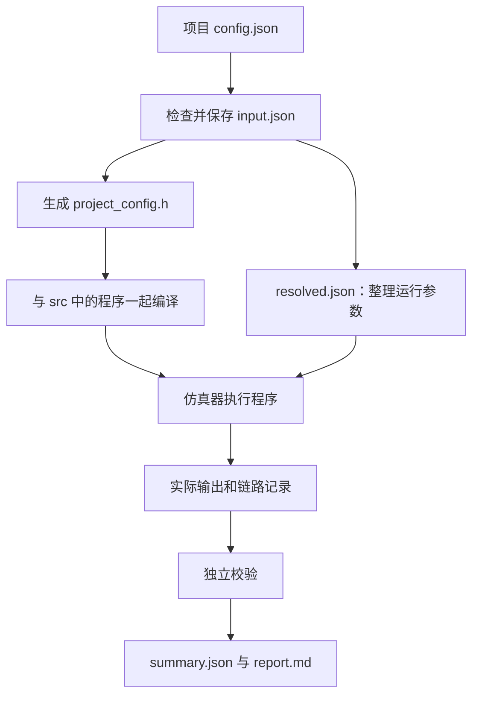

# 配置实验与 USER 负载详解

[文档目录](README.md) · 按需查参数，第一次使用先看目录中的入门或配置实验。

本篇用“改一个输入，再检查结果”的方式串起配置、源码、编译和验收。
`user` 是实际目录名，命令里使用小写。先按 [环境配置说明](01-用户环境配置说明.md)
完成根目录的 `./build.sh --storage ../axi_StorageStacked --jobs 4`。

## 1. 三类文件各做什么

| 类型 | 例子 | 谁使用 |
|---|---|---|
| 用户输入 | `user/smoke/config.json` | 运行入口读取，用来选择本次任务与平台参数 |
| 用户源码 | `host.cpp`、`kernel.cpp` | 编译器把它们变成设备能执行的程序 |
| 本次结果 | `user/smoke/result/某次运行/` | 保存输入快照、二进制、日志、实际输出和检查结果 |

JSON 负责“这次选什么参数”，源码负责“具体怎么算”。
修改 `program.type` 会改变编译配置与校验约定，实际编译哪份源码由 `src/Makefile` 决定。

## 2. 第一次运行，先保留默认配置

以下命令从本项目仓库根目录开始：

```bash
cd user
./run.sh smoke --output result/baseline-01
cat smoke/result/baseline-01/report.md
cat smoke/result/baseline-01/summary.json
```

新输出目录必须尚不存在。终端的三阶段分别是：

1. **编译**：把 C++ 源码和本次输入编译成程序，必要时构建对应平台。
2. **仿真**：执行程序，记录计算、读写和返回数据。
3. **校验**：检查实际输出，还要检查 AXI、UCIe 和内存模型中的传输是否一致。

第二阶段结束后继续等待第三阶段；`completion.json` 只是设备完成记录。
最后的 `summary.json.passed=true` 才是整次运行通过。

## 3. 改输入 41 → 100，预期输出 42 → 101

下面仍在 `user/`；复制配置，保留原文件以便比较：

```bash
cp smoke/config.json smoke/input100.json
python3 - <<'PY'
import json
from pathlib import Path
p = Path('smoke/input100.json')
c = json.loads(p.read_text())
c['program']['input'] = 100
p.write_text(json.dumps(c, indent=2) + '\n')
PY
python3 -m json.tool smoke/input100.json
./run.sh smoke --config input100.json --output result/input100-01
cat smoke/result/input100-01/smoke_summary.json
```

`python3 -m json.tool` 只检查 JSON 语法；字段范围、平台限制和实际运算仍由运行入口检查。
本例预期输出是 101。也可以使用 `4294967295`：它是 32 位无符号数最大值，
加一按 32 位回绕为 0。JSON 中写十进制数，不要写 `0xffffffff`。

### 命令路径逐字解释

`./run.sh smoke --config input100.json --output result/input100-01` 中：

| 部分 | 含义 |
|---|---|
| `smoke` | 选择 `user/smoke/`，不是寻找名叫 smoke 的系统命令 |
| `input100.json` | 相对于所选项目，实际是 `user/smoke/input100.json` |
| `result/input100-01` | 相对于所选项目，实际是 `user/smoke/result/input100-01/` |

把 `--config` 写成 `smoke/input100.json` 会多拼一层 smoke。
绝对路径、越出项目目录的路径、已有结果目录都会被拒绝。
省略 `--output` 时会新建带时间戳的目录，适合重复试验。

## 4. 配置如何到达运行程序



例如 `program.input=100` 会变为 `SMOKE_INPUT` 编译常量。
`memsim.scale` 则进入内存模型配置。一次运行已经保存 `input.json` 后，
你再改原配置，不会改变这次已经固定的输入；下一次运行才会读新文件。

`project_config.h` 由构建器在内部编译目录生成。Vortex 还把它与源码副本保存在本次 `build/sources/`。
日常修改用户配置或源码，不要修改自动生成的头文件。

## 5. 什么情况需要重新构建

| 修改位置 | 操作与影响 |
|---|---|
| `program` 输入、prompt、生成长度 | 重新运行项目，入口重新编译本次程序 |
| `src/` 源文件或 Makefile | 重新运行项目，用新结果目录保留本次产物 |
| 时钟、AXI 队列、内存倍率等运行参数 | 重新运行项目，核对输入快照和实际配置 |
| `ucie` 参数 | 重新运行项目，入口会处理对应的链路编译配置 |
| GPU 核数、warp、线程上下文和缓存结构 | 运行入口检查平台配置变化并重建所需组件 |
| `integration/` 或公共 AXI/内存源码、仓库位置 | 回仓库根目录执行 `./build.sh`，再运行和验收 |

平台就绪检查不保证发现任意源码编辑。主动修改平台代码后，使用根目录构建入口。
`--jobs` 只控制现实机器编译并行度。CPU/GPU 核数由 JSON 的 `host`、`gpu` 控制。

## 6. 用相同程序比较正常内存和慢内存

仍在 `user/`，先复制原配置：

```bash
cp smoke/config.json smoke/slow.json
python3 - <<'PY'
import json
from pathlib import Path
p = Path('smoke/slow.json')
c = json.loads(p.read_text())
c['memsim']['scale'] = 4
p.write_text(json.dumps(c, indent=2) + '\n')
PY
./run.sh smoke --config config.json --output result/normal-01
./run.sh smoke --config slow.json --output result/slow-01
```

先核对两次都通过，输入相同、输出相同，再比较时间。
`scale=4` 改变内存模型的步长；处理器、AXI、链路和软件初始化仍有各自开销，
整次运行的时间不一定恰好乘四。

| 配置 | 可以怎样理解 | 到哪里核对 |
|---|---|---|
| `axi.outstanding` | 桥里最多允许多少笔请求尚未完成 | `protocol_summary.json` 的实际在途统计 |
| `memsim.slots` | 内存桥最多同时接住多少个 AXI burst | 输入及实际配置、内存桥记录 |
| `memsim.queue` | 内存侧排队容量 | `memsim_config.json` 的 `queue_depth` |
| `memsim.channels` | 内存模型的通道数量 | `memsim_config.json` 的 `channels` |
| `memsim.scale` | 内存周期放大多少倍 | `memsim_config.json` 的 `timing_scale` |
| `memsim.response_hold` | 内存完成后再等多少个内存周期才交回 | 内存桥的完成与响应时间 |
| `axi.stalls` | 是否主动插入握手停顿来检查等待行为 | VCD 中的 `VALID=1, READY=0` |
| `axi.replay` | 是否注入链路错误以检查重传 | 链路检查结果中的实际重放记录 |

“允许 16 笔在途”表示容量上限，不保证短程序真的同时发出 16 笔。
队列、槽位和通道控制不同环节，调大某一项不保证一定更快。

## 7. 时间与容量的单位

| 写法 | 换算 |
|---|---|
| `1 byte` | 8 bit |
| `AXI256` | 总线每拍有 32 个字节位置；窄访问可以只使用其中一部分 |
| `1 KiB / 1 MiB` | 1024 字节 / 1048576 字节 |
| `500 MHz` | 一个周期 2 ns |
| `1000 MHz` | 一个周期 1 ns |
| `1 ns` | 1000000 fs |
| `20000000000000 fs` | 20 ms 的模拟时间 |

`simulation.max_ticks` 限制模型中的时间，不是你等了多少秒。
仿真 20 ms 可能在现实机器上计算很久；终端等待时长不能直接当成设备性能。
比较周期时先确认属于 CPU、GPU/NPU、AXI 还是内存，各自周期可能不同。

## 8. LLM 最小对照：只切换 KV cache

LLM 每次预测一个字符。`"red "` 的末尾空格也算一个字符，
因此输入长度为 4，`generated_tokens=3` 表示再生成 3 个字符。

```bash
cp llm/config.json llm/no_cache.json
python3 - <<'PY'
import json
from pathlib import Path
p = Path('llm/no_cache.json')
c = json.loads(p.read_text())
c['program']['kv_cache'] = False
p.write_text(json.dumps(c, indent=2) + '\n')
PY
./run.sh llm --output result/cache-on-01
./run.sh llm --config no_cache.json --output result/cache-off-01
```

KV cache 保存前面位置计算出的 K 和 V，后面可以继续使用。
默认输入下，打开时处理位置数为 `4+1+1=6`，关闭时为 `4+5+6=15`。
两次都应生成 `blu`；还要检查数值参考与完整链路，不能只比较文本。

模型允许的字符、内存布局和输出字段详见 [LLM 说明](03-LLM简要说明.md)。
这个小模型用于观察计算和存储过程，输入中文或任意英文句子可能包含词表外字符。

## 9. 新任务的目录和计算约定

新项目最少需要完整 `config.json`、`src/Makefile` 和源码；
可以从 SMOKE 复制配置和源码开始，不必复制 `result/`。
运行入口按目录名发现项目，无需修改脚本中的项目列表。

| 程序类型 | 配置要求 | 适合什么 |
|---|---|---|
| `smoke` | `type/input/workers` | 输入加一，并按固定方式验证 |
| `tiny_llm` | `type/prompt/generated_tokens/kv_cache` | 配合模型头文件做字符推理 |
| `custom` | `type/defines/expect/workers` | 自己规定运算和输出字 |

例如自定义程序用 `defines` 提供 `INPUT=41`，生成的宏是 `APP_INPUT`。
`expect` 中每项指定一个 4 字节输出的地址和期望值；它只参与检查，不代替设备运算。
Vortex 的地址字符串应在 `0x90000000` 至 `0x9005ffff` 用户缓冲区内。还需要主机程序上传、发射并按生成的 readback_ranges 读回结果。
输出地址应 4 字节对齐。这里只开放当前校验器支持的约定；
若改模型结构、浮点输出解释或复杂结果格式，还需要同步设计独立检查。

## 10. 失败后先查哪一个文件

| 失败位置或提示 | 先看什么 | 常见处理 |
|---|---|---|
| `expected fields`、字段范围错误 | 本次选择的 JSON | 保留完整字段；布尔值用 `true/false`，数字不加引号 |
| `Use a relative path` | 命令中的配置、输出路径 | 使用项目内相对路径 |
| `File exists` | `--output` 指定目录 | 换新目录，不覆盖旧运行 |
| 编译失败 | `build.log` | 先看最早的编译错误，核对源码、头文件和 SDK 路径 |
| 仿真失败 | `run.log`、`completion.json` | 检查设备状态、超时、未完成请求和参数不一致 |
| 校验失败 | `validation.log`、`verification.log` | 找具体检查项，再对照实际字节、地址与波形 |
| 找不到报告 | 终端的最早错误 | 配置检查在创建目录前失败时，可能还没有报告 |
| 显示正在校验很久 | 校验日志及进程是否仍在推进 | 大波形解析需要时间，已有 completion 不代表校验结束 |

`--test` 使用内置回归配置，不能同时指定实验配置或输出。
从 `user/` 执行 `./run.sh smoke --test` 或 `./run.sh llm --test`；
从根目录执行 `./build.sh --test` 才是平台完整回归。

## 11. 对照源码查依据

- 项目命令：[user/run.sh](../user/run.sh)。
- 字段限制：[configure.py](../third_party/gem5/runtime/configure.py)。
- 路径规则与快照：[session.py](../third_party/gem5/runtime/session.py)。
- 配置如何进入程序：[compile.py](../third_party/gem5/runtime/compile.py)。
- 请求怎样送入存储：[integration 说明](04-integration介绍.md)。

本篇的数值示例来自当前源码关系；新实验的实际周期、事务数和通过结论应读取自己的新结果。
